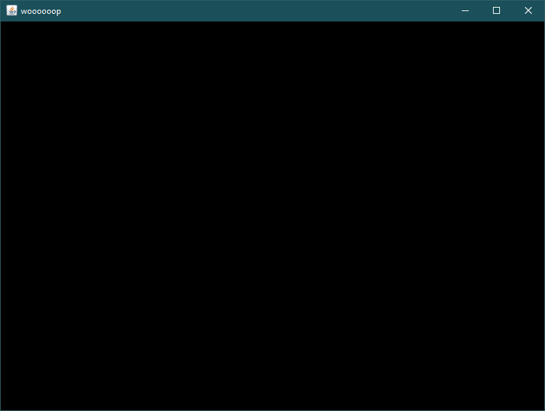
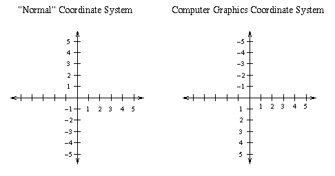
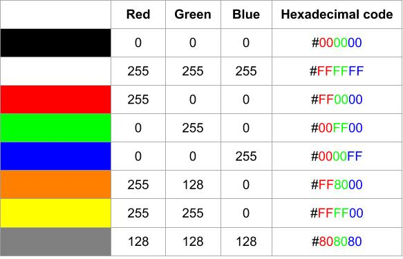
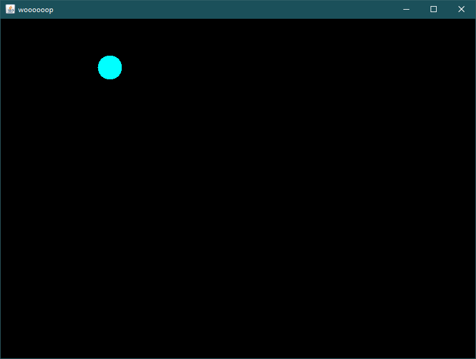
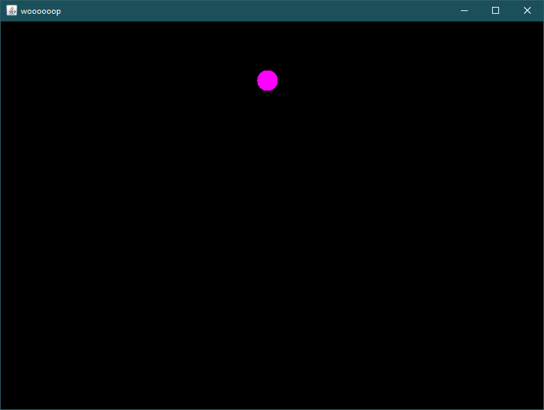

A pong game in java (I don't like java aaaaaaaaaaaa 😩)

## Getting started
### Creating a simple window
Create an instance of `SimpleGameWindow` class in your main code:
```java
public class Main{
    public static void main(String args[]){
        SimpleGameWindow sgw= new SimpleGameWindow(800, 600, "woooooop");   
    }
}
```
In this case, the window instance is called `sgw`. When run, a blank black window will be shown which its width is 800 pixels, its height is 600 pixels, and its title is *"woooooop"*.



Whenever you need to change something in this new window, you should do it by using `sgw`'s methods. You can add new methods to `SimpleGameWindow` class to add more functionality to it.

### Coordination system in programming
In most GUI environments, coordination system is a little bit different from the normal Cartesian system; The only difference is that the y axis is upside down. So, if you move downwards, the y factor of your position will increase unlike the normal system, where the y factor decreases.



### Colors in programming
Each pixel on your screen is made of three sub-pixels with red, green, and blue colors. The combination of different values of these colors can make every color that you see on your screen. So every color can be defined by 3 values: red, green, blue; also known as RGB. In programming, every color is defined by these 3 values.


RGB values vary from 0 to 255. Some times these values are shown in HEX (base 16) format which vary from 00 to ff. When you put HEX value of r, g, and b values in order, it is called *color code*. In other words, each color has its own unique color code.
HEX color codes are prefixed with *#*. For example: `#ff0000` is "perfect red" with r=255, g=0, b=0; and `#0b1e35` is called "delta navy blue" with r=11, g=30, b=53.



### Drawing a circle
Let's get back to coding!
To draw a circle on the window you just made, use the `drawSimpleCircle` method of your `SimpleGameWindow` instance (in this case, the instance is `sgw`).

```java
import java.awt.Color;

public class Main{
    public static void main(String args[]){
        SimpleGameWindow sgw= new SimpleGameWindow(800, 600, "woooooop");

        sgw.drawSimpleCircle(200, 100, 40, new Color(0, 255, 255));
    }
}
```

This code draws a circle in your window, which its center is located at (200,100), its radius is 40, and its color is cyan (r=0, g=255, b=255; `#00ffff`).

**Don't forget to import the `Color` class at the beginning of your code.**



### Clearing the window
Use the `clear` method to clear everything on the window.

```java
import java.awt.Color;

public class Main{
    public static void main(String args[]){
        SimpleGameWindow sgw= new SimpleGameWindow(800, 600, "woooooop");

        sgw.drawSimpleCircle(200, 100, 40, new Color(0, 255, 255));
        sgw.clear();
        sgw.drawSimpleCircle(400, 100, 30, new Color(255, 0, 255));
    }
}
```
The above code draws a cyan circle, clears the screen and then draws a pink (r=255, g=0, b=255; `#ff00ff`) circle. The cyan circle is cleared, so we only see the pink circle.



### getting pressed keys
As you open your window, every key you press on your keyboard is captured and stored in a que. You can get pressed keys via `getKey` method. every time you use this method, the key you had pressed comes out of the que and you can sotre it in a suitable variable. If the que is empty, the method returns `null`.

```java
public class Main{
    public static void main(String args[]){
        SimpleGameWindow sgw= new SimpleGameWindow(800, 600, "woooooop");

        Character input= sgw.getKey();
        System.out.println(input);
    }
}
```
This code gets the pressed key immediately after the window shows up, and prints the . You can't press a key in the brief time between opening of the window and `getKey` method unless you are **Giga Chad™ 🗿**. So output of this program will always be *null*. But you are a programmer and you want to press keys like **Giga Chad™ 🗿**. What should you do? Well, as a programmer you have a powerful weapon called ***🔥loop🔥***! You should write a loop to always check for input and whenever the input in not `null`, do whatever you want with that input.

```java
public class Main{
    public static void main(String args[]){
        SimpleGameWindow sgw= new SimpleGameWindow(800, 600, "woooooop");

        Character input= null;
        while(input == null){
            input= sgw.getKey();
            // wait a bit
            try{
                Thread.sleep(1);
            } catch(InterruptedException e){};
        }
        // doing whatever I want
        System.out.println(input);
    }
}
```
This code checks for input in loop while it is not `null`. As soon as I press a key on my keyboard, `input` variable will contain the character I typed so the while loop will be stopped and the program continues. (apparently) There should be a small delay in the loop for the input to be captured.
On the subject of delays...

### delays
Sometimes we need our program to stop for a some amount of time. To make some delays in your program use the following code:

```java
try{
    Thread.sleep(20);
} catch(InterruptedException e){};
```
the number you put in `Thread.sleep()` is delay time in milliseconds which is 20 ms in this example.


# ========🏗UNDER CONSTRUCTION🏗========


