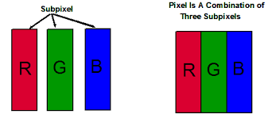
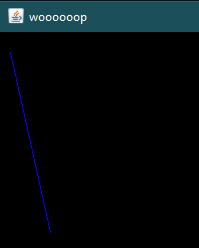
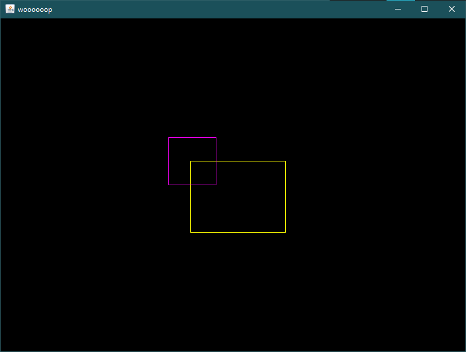

### A pong game in java (I don't like java aaaaaaaaaaaa 😩)
This is an assignment project for my advanced programming class. The goal is to make a pong game using `SimpleGameWindow.class` file provided by TA.

Features that the game must have (based on TA's sayings):
- Graphical User Interface
- Gameplay mechanics *(Is there a game without gameplay mechanics???)*
- Player controls *(Pong is not a zero-player game; Ofcourse it has player input 😑)*
- Collision detection
- Score tracking
- Game over conditions
- Customization
- Power-ups

Extra features for extra points:
- AI opponent
- Difficulty levels
- Multiplayer Network Support *(I'm not gonna do this LOL)*
- Animations
- Version control *(That's why you are here)*
- Code comments

## Table of contents
0. [Table of contents](#table-of-contents) (Recursion haha 😉)
1. [Getting started](#getting-started)
   - [Creating a simple window](#creating-a-simple-window)
   - [Coordination system in programming](#coordination-system-in-programming)
   - [Colors in programming](#colors-in-programming)
   - [Drawing a circle](#drawing-a-circle)
   - [Clearing the window](#clearing-the-window)
   - [Getting pressed keys](#getting-pressed-keys)
   - [Delays](#delays)
2. [Adding more features](#adding-more-features-to-simplegamewindow-class)
   - [Drawing a rectangle](#drawing-a-rectangle)
   - [Drawing a line](#drawing-a-line)
   - [Drawing an image](#drawing-an-image)
3. [Game sprites](#game-sprites)
   - [Sprite properties](#sprite-properties)
   - [Sprite constructor](#sprite-constructor)
   - [Getter and setter for x and y](#getter-and-setter-for-x-and-y)
   - [Drawing the sprite](#drawing-the-sprite)
   - [Changing the frame](#changing-the-frame)
   - [Using the sprite class](#using-the-sprite-class)
4. [Hitboxes](#hitboxes)
   - [Hitbox class](#hitbox-class)
   - [Getter and setter for hitbox variables](#getter-and-setter-for-hitbox-variables)
   - [Collision detection](#collision-detection)
   - [Drawing the hitboxes](#drawing-the-hitboxes)
   - [Testing the hitboxes](#testing-the-hitboxes)

## Getting started
### Creating a simple window
Create an instance of `SimpleGameWindow` class in your main code:
```java
public class Main{
    public static void main(String args[]){
        SimpleGameWindow sgw= new SimpleGameWindow(800, 600, "woooooop");   
    }
}
```
In this case, the window instance is called `sgw`. When run, a blank black window will be shown which its width is 800 pixels, its height is 600 pixels, and its title is *"woooooop"*.


Whenever you need to change something in this new window, you should do it by using `sgw`'s methods. You can add new methods to `SimpleGameWindow` class to add more functionality to it.

### Coordination system in programming
In most GUI environments, coordination system is a little bit different from the normal Cartesian system; The only difference is that the y axis is upside down. So, if you move downwards, the y factor of your position will increase unlike the normal system, where the y factor decreases.


### Colors in programming
Each pixel on your screen is made of three sub-pixels with red, green, and blue colors. The combination of different values of these colors can make every color that you see on your screen. So every color can be defined by 3 values: red, green, blue; also known as RGB. In programming, every color is defined by these 3 values.



RGB values vary from 0 to 255. Some times these values are shown in HEX (base 16) format which vary from 00 to ff. When you put HEX value of r, g, and b values in order, it is called *color code*. In other words, each color has its own unique color code.
HEX color codes are prefixed with *#*. For example: `#ff0000` is "perfect red" with r=255, g=0, b=0; and `#0b1e35` is called "delta navy blue" with r=11, g=30, b=53.


### Drawing a circle
Let's get back to coding!
To draw a circle on the window you just made, use the `drawSimpleCircle` method of your `SimpleGameWindow` instance (in this case, the instance is `sgw`).

```java
import java.awt.Color;

public class Main{
    public static void main(String args[]){
        SimpleGameWindow sgw= new SimpleGameWindow(800, 600, "woooooop");

        sgw.drawSimpleCircle(200, 100, 40, new Color(0, 255, 255));
    }
}
```

This code draws a circle in your window, which its center is located at (200,100), its radius is 40, and its color is cyan (r=0, g=255, b=255; `#00ffff`).

**Don't forget to import the `Color` class at the beginning of your code.**


### Clearing the window
Use the `clear` method to clear everything on the window.

```java
import java.awt.Color;

public class Main{
    public static void main(String args[]){
        SimpleGameWindow sgw= new SimpleGameWindow(800, 600, "woooooop");

        sgw.drawSimpleCircle(200, 100, 40, new Color(0, 255, 255));
        sgw.clear();
        sgw.drawSimpleCircle(400, 100, 30, new Color(255, 0, 255));
    }
}
```
The above code draws a cyan circle, clears the screen and then draws a pink (r=255, g=0, b=255; `#ff00ff`) circle. The cyan circle is cleared, so we only see the pink circle.


### Getting pressed keys
As you open your window, every key you press on your keyboard is captured and stored in a que. You can get pressed keys via `getKey` method. every time you use this method, the key you had pressed comes out of the que and you can sotre it in a suitable variable. If the que is empty, the method returns `null`.

```java
public class Main{
    public static void main(String args[]){
        SimpleGameWindow sgw= new SimpleGameWindow(800, 600, "woooooop");

        Character input= sgw.getKey();
        System.out.println(input);
    }
}
```
This code gets the pressed key immediately after the window shows up, and prints the . You can't press a key in the brief time between opening of the window and `getKey` method unless you are **Giga Chad™ 🗿**. So output of this program will always be *null*. But you are a programmer and you want to press keys like **Giga Chad™ 🗿**. What should you do? Well, as a programmer you have a powerful weapon called ***🔥loop🔥***! You should write a loop to always check for input and whenever the input in not `null`, do whatever you want with that input.

```java
public class Main{
    public static void main(String args[]){
        SimpleGameWindow sgw= new SimpleGameWindow(800, 600, "woooooop");

        Character input= null;
        while(input == null){
            input= sgw.getKey();
            // wait a bit
            try{
                Thread.sleep(1);
            } catch(InterruptedException e){};
        }
        // doing whatever I want
        System.out.println(input);
    }
}
```
This code checks for input in loop while it is `null`. As soon as I press a key on my keyboard, `input` variable will contain the character I typed so the while loop will be stopped and the program continues. (apparently) There should be a small delay in the loop for the input to be captured.

On the subject of delays...

### Delays
Sometimes we need our program to stop for a some amount of time. To make some delays in your program use the following code:

```java
try{
    Thread.sleep(20);
} catch(InterruptedException e){};
```
the number you put in `Thread.sleep()` is delay time in milliseconds which is 20 ms in this example.


## Adding more features to `SimpleGameWindow` class
For now, our `SimpleGameWindow` class has very limited features, including: drawing circle, clearing the frame, recording typed keys. To have some reasonably good tools for game development, we need to add more functionality to this class. Currently, this is the base class we have (It didn't have comments, so I added them 😒):
```java
// importing packages (aka libraries)
import java.awt.BorderLayout;
import java.awt.Color;
import java.awt.Graphics;
import java.awt.Graphics2D;
import java.awt.Image;
import java.awt.event.KeyEvent;
import java.awt.event.KeyListener;
import java.awt.image.BufferedImage;
import java.util.LinkedList;
import java.util.Queue;
// importing other packages (other libraries)
import javax.swing.JFrame;
import javax.swing.JPanel;
import javax.swing.SwingUtilities;
// window class
// develop the project by changing this class
public class SimpleGameWindow {
    // window related objects
    private JFrame frame;
    private JPanel panel;
    private Image image;
    // window variables
    private int width;
    private int height;
    // a que for storing pressed keys
    private Queue<Character> keyQueue;
    // class constructor
    // this method is run when a new instance of this class is created
    // parameters:
    //   width      -> desired window width in pixels
    //   height     -> desired window height in pixels
    //   title      -> window title that appears on top bar
    public SimpleGameWindow(int width, int height, String title){
        // setting size variables for futures uses
        this.height = height;
        this.width = width;
        // initializing the que
        keyQueue = new LinkedList<>();
        // some giberrish about initializing the window and frame and blah blah blah....
        image = new BufferedImage(width, height, BufferedImage.TYPE_INT_RGB);
        frame = new JFrame(title);
        panel = new JPanel(true) {
            @Override
            public void paintComponent(Graphics g) {
                super.paintComponent(g);
                g.drawImage(image, 0, 0, null); //TODO: Attend null observer later
            }
        };
        frame.setSize(width, height);
        panel.setSize(width, height);
        frame.setDefaultCloseOperation(JFrame.DISPOSE_ON_CLOSE);
        frame.setLayout(new BorderLayout());
        frame.add(panel, BorderLayout.CENTER);
        frame.setFocusable(false);
        panel.setFocusable(true);
        panel.requestFocus();
        // other gibberish about setting key listener and etc...
        KeyListener keyListener = new KeyListener() {
            @Override
            public void keyPressed(KeyEvent arg0) {
            }

            @Override
            public void keyReleased(KeyEvent arg0) {
            }

            @Override
            public void keyTyped(KeyEvent ke) {
                keyQueue.add(ke.getKeyChar());
            }
        };
        panel.addKeyListener(keyListener);
        // showing the window
        SwingUtilities.invokeLater(new Runnable() {
            @Override
            public void run() {
                frame.setVisible(true);
            }
        });
    }
    // this method draws a complex circle
    // parameters:
    //   x           -> circle center x
    //   y           -> circle center y
    //   r           -> circle radius
    //   colour      -> circle color object (not colour 😒)
    public void drawSimpleCircle(int x, int y, int r, Color colour)
    {
        SwingUtilities.invokeLater(new Runnable() {
            @Override
            public void run() {
                Graphics2D g2d = (Graphics2D) image.getGraphics();
                g2d.setColor(colour);
                g2d.fillOval(x - r, y - r, r, r);
                panel.repaint();
            }
        });
    }
    // this method clears the frame
    public void clear() {
        SwingUtilities.invokeLater(new Runnable() {
            @Override
            public void run() {
                Graphics2D g2d = (Graphics2D) image.getGraphics();
                g2d.clearRect(0, 0, width, height);
                panel.repaint();
            }
        });
    }
    // this method gets a key from user (like getch() in c++ but worse)
    public Character getKey() {
        if (!keyQueue.isEmpty())
            return keyQueue.poll();
        return null;
    }
}
```

To make things easy, we'll only make different versions of `drawSimpleCircle` method to draw different things on screen.

P.S. *What is a simple circle??? Is there a complex circle too!?*

### Drawing a rectangle
```java
    // this method draws a filled rectangle
    // parameters:
    //   x           -> rectangle upper left corner x
    //   y           -> rectangle upper left corner y
    //   w           -> rectangle width (x axis)
    //   h           -> rectangle height (y axis)
    //   color       -> rectangle color
    public void drawFillRectangle(int x, int y, int w, int h, Color color){
        SwingUtilities.invokeLater(new Runnable() {
            @Override
            public void run() {
                Graphics2D g2d = (Graphics2D) image.getGraphics();
                g2d.setColor(color);
                g2d.fillRect(x, y, w, h);
                panel.repaint();
            }
        });
    }
    // this method draws a hollow rectangle
    // parameters:
    //   x           -> rectangle upper left corner x
    //   y           -> rectangle upper left corner y
    //   w           -> rectangle width (x axis)
    //   h           -> rectangle height (y axis)
    //   color       -> rectangle color
    public void drawRectangle(int x, int y, int w, int h, Color color){
        SwingUtilities.invokeLater(new Runnable() {
            @Override
            public void run() {
                Graphics2D g2d = (Graphics2D) image.getGraphics();
                g2d.setColor(color);
                g2d.drawRect(x, y, w, h);
                panel.repaint();
            }
        });
    }
```

These two methods will be added to `SimpleGameWindow` class. Using below code will draw them on the window:
```java
import java.awt.Color;

public class Main{
    public static void main(String args[]){
        SimpleGameWindow sgw= new SimpleGameWindow(800, 600, "woooooop");

        sgw.drawRectangle(10, 10, 40, 30, new Color(255, 0, 0));
        sgw.drawFillRectangle(70, 10, 40, 30, new Color(0, 255, 0));
    }
}
```


In the class methods, `g2d.fillRoundRect()` and `g2d.fillRoundRect()` are also available for drawing rectangles with round corners.

### Drawing a line
like before we are adding a new method to class to draw a line
```java
    // this method draws a line
    // parameters:
    //   x1          -> line point 1 x
    //   y1          -> line point 1 y
    //   x2          -> line point 2 x
    //   y2          -> line point 2 y
    //   color       -> line color
    public void drawLine(int x1, int y1, int x2, int y2, Color color){
        SwingUtilities.invokeLater(new Runnable() {
            @Override
            public void run() {
                Graphics2D g2d = (Graphics2D) image.getGraphics();
                g2d.setColor(color);
                g2d.drawLine(x1, y1, x2, y2);
                panel.repaint();
            }
        });
    }
```

drawing the line (shortened):
```java
sgw.drawLine(10, 20, 50, 200, new Color(0,0,255));
```


### Drawing an image
Drawing images is very critical for game development, since it allows developers to draw complex shapes and display animations. Since we are using an external file, the image displaying process is a bit harder. first we should define an `Image` object and load the image to it using the `Toolkit` class. Then we need to wait for image to be loaded by using a `MediaTracker` instance. After doing these things, we are safe to draw the image 😵.
```java
import java.awt.Image;
import java.awt.Toolkit;
import java.awt.MediaTracker;
import javax.swing.JPanel;

public class Main{
    public static void main(String args[]){
        SimpleGameWindow sgw= new SimpleGameWindow(800, 600, "woooooop");

        // loading the image
        Image img= Toolkit.getDefaultToolkit().getImage("images/troll.png");
        // waiting for image to be loaded
        MediaTracker mediaTracker= new MediaTracker(new JPanel());
        mediaTracker.addImage(img, 0);
        try{mediaTracker.waitForAll();}
        catch(InterruptedException e){e.printStackTrace();}
        // drawing the image
        sgw.drawImage(10, 10, img);
    }
}
```

The class method would be the easy part:
```java
    // this method draws an image
    // parameters:
    //   x           -> image upper left corner x
    //   y           -> image upper left corner y
    //   path        -> circle color object
    public void drawImage(int x, int y, Image img){
        SwingUtilities.invokeLater(new Runnable() {
            @Override
            public void run() {
                Graphics2D g2d = (Graphics2D) image.getGraphics();
                g2d.drawImage(img, x, y, panel);
                panel.repaint();
            }
        });
    }
```

The result:


## Game sprites
In 2D games, evey animation or image you see is called a sprite. To have have a proper game, we need to design a basic `Sprite` class to use later in our game development.

### Sprite properties
When designing a class, first we need to define its properties. Class properties are variables and object instances of that class. Now, let's think what a sprite class should have as its properties. Thinking of a sprite as an animation will make this job a little bit easier. Animations are basically an array of images that change over time. So, we have figured out that for our `Sprite` class we need an array of images and number of images to load for animation. When animations are drawn, we should know where to draw them so we will need two variables for x and y coordinates of the sprite. At last, we should know which frame of animation we should draw, so we will add an index variable to our list of class properties. With our class properties defined, we can now write a java class for it:
```java
import java.awt.Image;

public class Sprite {
    private Image frames[]; // image array
    private int n; // number of frames
    private int x, y; // drawing coordinates
    private int index; // index of current frame
}
```

### Sprite constructor
Classes can have constructor functions. Constructor functions are run when a new instance of the class is created and their purpose is to do intializations (E.G. loading images) of that instance and its properties. Multiple constructors can be written for different cases of initializing.
I want to put frames of the animations I want in a folder and name those frames from 0 to any number. Based on this, my constructor function would get that dirctory path and number of frames as its paramters. In that function, `frames` array will be filled with images loaded from that directory using a loop. The constructor should get two x and y values for locations of that sprite as well.
```java
    // class constructor
    // parameters:
    //   path       -> path of directory which the frames are stored in
    //   n          -> number of frames in the directory
    //   x          -> x coordinate of the sprite
    //   y          -> y coordinate of the sprite
    public Sprite(String path, int n, int x, int y){
        // loading the images and wait to be loaded
        frames= new Image[n]; // array definition
        MediaTracker mediaTracker= new MediaTracker(new JPanel());
        for(int i=0; i < n; i++){
            Image img= Toolkit.getDefaultToolkit().getImage(path + "/" + i + ".png");
            mediaTracker.addImage(img, i);
            frames[i]= img;
        }
        // waiting
        try{mediaTracker.waitForAll();}
        catch(InterruptedException e){e.printStackTrace();}
        // setting class properties values
        this.n= n;
        this.x= x;
        this.y= y;
        index= 0; // initial index is 0
    }
```

Don't forget `import java.awt.MediaTracker;` and `import java.awt.Toolkit;` at the top of the class file.

### Getter and setter for x and y
x and y variables are better to be private. To access them from other classes, we should add their getter and setter methods to `Sprite` class.
```java
    // these methods get and set x and y
    public int getX(){
        return x;
    }
    public int getY(){
        return y;
    }
    public void setX(int x){
        this.x= x;
    }
    public void setY(int y){
        this.y= y;
    }
```

### Drawing the sprite
The `Sprite` class should have a method to return `Image` object of its current frame, so we can draw it.
```java
    // this method returns current frame
    public Image getFrame(){
        return frames[index];
    }
```

Just like the [section 2](#adding-more-features-to-simplegamewindow-class) we are going to add a new method to `SimpleGameWindow` class to draw a sprite.

```java
    // this method draws a sprite
    public void drawSprite(Sprite spr){
        SwingUtilities.invokeLater(new Runnable() {
            @Override
            public void run() {
                Graphics2D g2d = (Graphics2D) image.getGraphics();
                Image img= spr.getFrame();
                int cornerX, cornerY;
                cornerX= spr.getX() - img.getWidth(null)/2;
                cornerY= spr.getY() - img.getHeight(null)/2;
                g2d.drawImage(img, cornerX, cornerY, panel);
                panel.repaint();
            }
        });
    }
```

I wanted x and y of the sprite to be interpreted as position of its center. Because of that, some small calculations are done to get position of upper right corner of the image before drawing.

### Changing the frame
changing the `index` variable of the sprite changes its frame... *Simplicity itself*. So bascially we need a getter and setter function for `index` variable. For more coolness, an additional method will be added to change index to next frame automatically 😎.
```java
    // these methods get, set, or change the frame
    public int getIndex(){
        return index;
    }
    public void setIndex(int index){
        this.index= index;
    }
    public void next(){
        index++;
        // if index is on the last frame, start over the animation (set index to 0)
        if(index >= n) index= 0;
    }
```

### Using the sprite class
For this example, we are going to display an animation on loop
```java
public class Main{
    public static void main(String args[]){
        SimpleGameWindow sgw= new SimpleGameWindow(800, 600, "woooooop");
        // defining the sprite with 24 frames with center of (200,250)
        Sprite sprite= new Sprite("assets/animations/demo", 24, 200, 250);

        while(true){
            // draw the sprite and change to next frame
            sgw.drawSprite(sprite);
            sprite.next();
            // small delay
            try{
                Thread.sleep(20);
            } catch(InterruptedException e){};
        }
    }
}
```


## Hitboxes
In video games, each object has a hitbox. A hitbox determines object's actual shape which effects and gets effected by the game environment, unlike the sprites that are only what we see of game objects and usually don't effect gameplay. If you’ve ever played a game and frustratedly shouted "I totally hit you!" you have probably experienced hitboxes that don’t quite line up with their sprites.


### Hitbox class
A hitbox can have different shapes like circle, rectangle, triangle, etc. For this game we will only stick to rectangle hitboxes. like what we did in [section 3](#sprite-properties), we should first define our hitbox properties. Since the hitbox is a rectangle, it makes sense to have rectangle coordination variables (top left corner x, top left corner y, width, height) as its class properties. The constructor method simply sets the initial value of the variables.

```java
public class Hitbox {
    private int x; // top left corner x
    private int y; // top left corner y
    private int width; // width (obviously... 😐)
    private int height; // height (obviously... 😐)
    // constructor method.
    // parameters: explain themselves
    public Hitbox(int x, int y, int w, int h){
        this.x= x;
        this.y= y;
        width= w;
        height= h;
    }
}
```

### Getter and setter for hitbox variables
Easy.
```java
    // getters and setters
    public int getX(){
        return x;
    }
    public int getY(){
        return y;
    }
    public int getWidth(){
        return width;
    }
    public int getHeight(){
        return height;
    }
    public void setX(int x){
        this.x= x;
    }
    public void setY(int y){
        this.y= y;
    }
    public void setWidth(int w){
        width= w;
    }
    public void setHeight(int h){
        height= h;
    }
```

### Collision detection
Collision detection is what separates regular rectangles from hitboxes. We should be able to determine if to Hitboxes collide, so we can perform appropriate actions on them.

Two rectangles are Colliding, if their sides are touching. Sides of every rectangle (with dimentions of cx,cy,w,h) are on lines with equations: *x*=cx, *x*=cx+w, *y*=cy, and *y*=cy+h. Suppose we have two rectangles `a(x1,y1,w1,h1)` and `b(x2,y2,w2,h2)`. Vertical sides of `a` **may** collide with horizontal sides of `b`, if closed intervals of `[x1, x1+w1]` and `[x2, x2+w2]` have intersection. In the same way, horizontal sides of `a` **may** collide with vertical sides of `b`, if closed intervals of `[y1, y1+h1]` and `[y2, y2+h2]` have intersection. if both of these two intersections exist, sides of rectangles are touching; Therefore, rectangles are colliding.

**Note**: Two closed intervals of `[a, b]` and `[c, d]` have intersection, if and only if `a <= d` and `b >= c`.

If you didn't understand all of above nonsense, don't worry. The code implementation is really simple.
```java
    // collision detection
    boolean collidesWith(Hitbox h){
        // x <= (h.x + h.width) && (x + width) >= h.x)    -> vertical intersection
        // y <= (h.y + h.height) && (y + height) >= h.y   -> horizontal intersection
        return (x <= (h.x + h.width) && (x + width) >= h.x) && (y <= (h.y + h.height) && (y + height) >= h.y);
    }
```

Maybe not *that* simple... ([reference](https://www.jeffreythompson.org/collision-detection/rect-rect.php))

### Drawing the hitboxes
Hitboxes are not meant to be drawn. But sometimes for test and debug purposes, we will need to draw them. We'll add a `drawHitbox` method to `SimpleGameWindow` class to draw a rectangle.
```java
    // this method draws a hitbox
    public void drawHitbox(Hitbox hb, Color color){
        SwingUtilities.invokeLater(new Runnable() {
            @Override
            public void run() {
                Graphics2D g2d = (Graphics2D) image.getGraphics();
                g2d.setColor(color);
                g2d.drawRect(hb.getX(), hb.getY(), hb.getWidth(), hb.getHeight());
                panel.repaint();
            }
        });
    }
```

### Testing the hitboxes
For the test example we are going to have two hitboxes, one fixed and the other one moving. When the hitboxes touch, the color of the moving one will change.
```java
import java.awt.Color;

public class Main{
    public static void main(String args[]){
        SimpleGameWindow sgw= new SimpleGameWindow(800, 600, "woooooop");
        // defining the hitboxes
        Hitbox fixed= new Hitbox(320, 240, 160, 120);
        Hitbox moving= new Hitbox(0, 200, 80, 80);

        while(true){
            // clear the frame
            sgw.clear();
            // draw the hitboxes based on collision
            sgw.drawHitbox(fixed, new Color(255, 255, 0));
            if(moving.collidesWith(fixed)) sgw.drawHitbox(moving, new Color(255, 0, 255));
            else sgw.drawHitbox(moving, new Color(0, 255, 255));
            // move the moving hitbox
            moving.setX(moving.getX()+1);
            // small delay
            try{
                Thread.sleep(30);
            } catch(InterruptedException e){};
        }
    }
}
```





# 🏗UNDER CONSTRUCTION🏗


